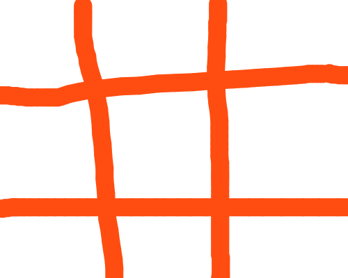

<div align="center" id="top"> 
  

&#xa0;

<!-- <a href="https://thpmorpion.netlify.app">Demo</a> -->

</div>

<h1 align="center">Thp Morpion</h1>

<p align="center">
  


</p>

<p align="center">
  <a href="#dart-about">About</a>   |   
  <a href="#sparkles-features">Features</a>   |  
  <a href="#rocket-technologies">Technologies</a>   |  
  <a href="#-requirements">Requirements</a>   |  
  <a href="#-starting">Starting</a>   |  
  <a href="#memo-license">License</a>   |  
  <a href="https://github.com/bricebasty" target="_blank">Author</a>
</p>

<br>

## 🎯 About

Describe your project

## ✨ Features

✔️ **Two-Player Game:** The application supports two players, and they can each input their names. Players alternate turns for fair gameplay.

✔️ **Board Visualization:** The game board is clearly represented in the terminal with cell numbers from 1-9 for each possible move. As the game progresses, the board updates to show the current state.

✔️ **Interactive User Input:** The game asks for player moves interactively and provides feedback on invalid inputs. Players select their moves by entering the cell number where they want to place their marker.

✔️ **Win Detection:** The game can detect win conditions (three consecutive marks in a row, column, or diagonal) and declare the winner, if one exists.

✔️ **Game Loop:** The game loop handles the turns between players, continually checks the game state, and ends the game when a win condition or a tie is reached.

✔️ **Score Keeping:** The application keeps track of the number of games won by each player. The score is displayed at the end of each game.

✔️ **Colorful Text Output:** Utilizing colored and styled text output for a more visually appealing and readable user interface.

✔️ **Rematch Feature:** After a game concludes, players have the option to play again without needing to restart the program.

✔️ **Clean and Modular Design:** The codebase is cleanly designed and separated into distinct classes (Player, Board, Game), each with their own responsibilities, for easy understanding and maintainability.

## 🚀 Technologies

The following tools were used in this project:

- [Ruby](https://www.ruby-lang.org/en/)
- [Bundler](https://bundler.io/)
- [Pry](https://github.com/pry/pry)
- [Rubocop](https://github.com/rubocop/rubocop)
- [RSpec](https://rspec.info/)

## ✅ Requirements

Before starting 🏁, you need to have [Git](https://git-scm.com), [Ruby ](https://www.ruby-lang.org/en/)and [Bundler](https://bundler.io/) installed.

## 🏁 Starting

```bash
# Clone this project
$ git clone https://github.com/bricebasty/thp-morpion

# Access
$ cd thp-morpion

# Install dependencies
$ bundle install

# Run the project 1
$ ruby app.rb
```

## 📝 License

This project is under license from MIT. For more details, see the [LICENSE](LICENSE.md) file.

Made with ❤️ by <a href="https://github.com/bricebasty" target="_blank">Brice Basty </a>

<a href="#top">Back to top </a>
